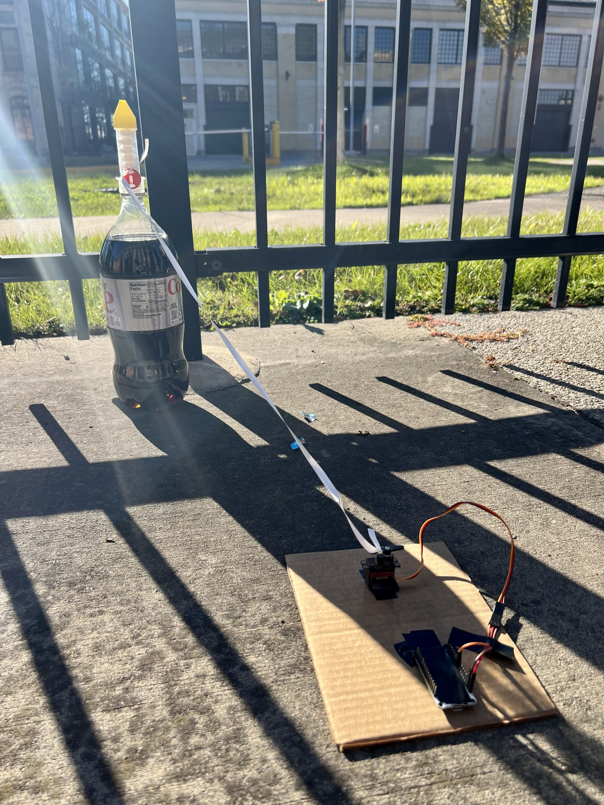
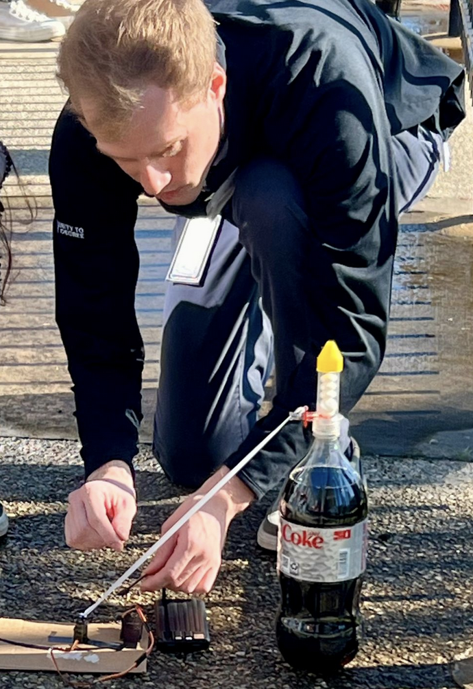
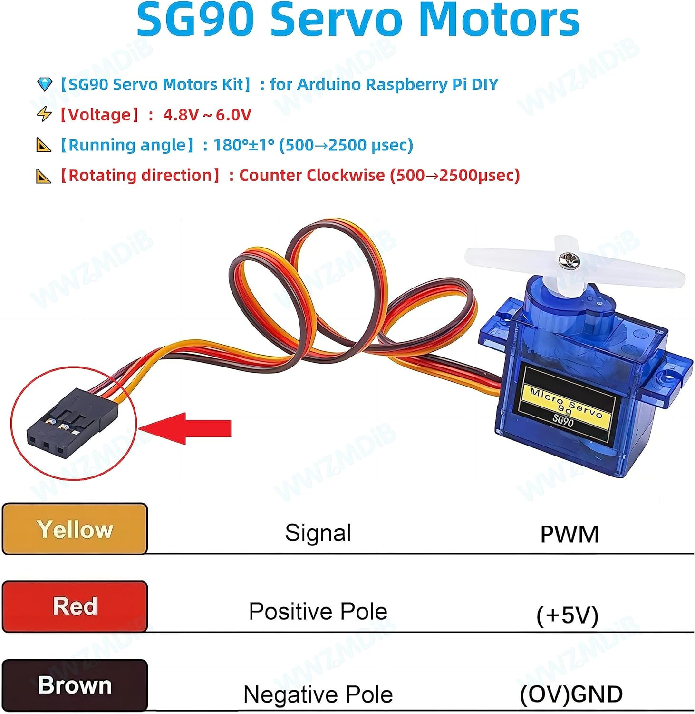

# STEM Outreach -- Arduino-based Diet Coke + Mentos Geyser

This project was used for teaching a STEM workshop. The target audience was high school students with no exposure to coding or engineering before - and we only had 15min per group. None had ever coded or built electronics, yet all groups were able to complete the project successfully!

> This year’s breakout session, “Coding Explosions,” had participants engineering a motor to pull a string and trigger a mentos eruption—what a blast! 🚀 The excitement was clear as the girls learned about mechanical, software, and electrical engineering.
>
> [View the post on LinkedIn](https://www.linkedin.com/posts/gentherm_stemgoesred-ugcPost-7254470881228271617-8EFR)

 

 

## Workshop Overview

**Objective**: Code an ESP32 to turn a Servo Motor 180 degrees, pulling a string that drops the Mentos into the Diet Coke.

**Materials**:

- Battery Pack (turns on the ESP32, starting the whole process)
- ESP32 Dev Board
- Servo Motor
- USBA to USB Micro Cable (programming the ESP32)
- Jumper Wires
- Cardboard
- Tape
- String/Ribbon
- Mentos
- Diet Coke
- (Optional) Geyser Tube (We used this one from [Amazon](https://www.amazon.com/Steve-Spangler-Science-Geyser-Experiment/dp/B082MS6V17))

**Student Roles** (3 students per group):

- **Software Engineer**: Fill in the code for the ESP32 to trigger the Servo Motor. Start with `src/incomplete.ino` and fill in the missing parts. Use `src/complete.ino` as a reference to help them understand what the code should do.
- **Mechanical Engineer**: Build the structure to hold the Diet Coke and Mentos trigger system.
- **Electrical Engineer**: Connect the ESP32 to the Servo Motor and power source. Learn about how to use jumper wires safely and which pins to use.

Every group of students launched theirs successfully, for a total of 10 bottles! 🚀

## Arduino Setup Steps

We used multiple computers so that each student could do their own typing. This way you can just edit the code and hit Run.

**Step 1: Set Up Arduino IDE for ESP32**

- Before using the ESP32Servo library, you'll need to make sure that the Arduino IDE is set up for ESP32 development.
- Install the ESP32 Board Package:
  1. Open the Arduino IDE.
  2. Go to `File > Preferences`.
  3. In the `Additional Boards Manager URLs` field, enter this URL:
     - `https://dl.espressif.com/dl/package_esp32_index.json`
  4. Click OK.
- Install ESP32 Board in Board Manager:
  1. Go to Tools > Board > Boards Manager.
  2. Search for "ESP32" and click the Install button for the "esp32" by Espressif Systems.
  3. Once installed, go to `Tools > Board` and select your ESP32 board model (e.g., "ESP32 Dev Module").

**Step 2: Install ESP32Servo Library**

- Install the `ESP32Servo` Library:
- Open the Arduino IDE.
- Go to `Sketch > Include Library > Manage Libraries`.
- In the Library Manager, search for "ESP32Servo".
- Install the "ESP32Servo" library by Kevin Harrington.

## Wiring Instructions

1. Attach the Red (Positive) wire of the Servo Motor to the 5V (**VIN**) pin on the ESP32.
2. Attach the Brown (Negative) wire of the Servo Motor to the **GND** pin on the ESP32.
3. Attach the Orange (Signal) wire of the Servo Motor one of a few GPIO pins on the ESP32. You can use almost any GPIO pin that supports PWM (e.g., GPIO 19, 21, 23, 25, 26, 27).

  

